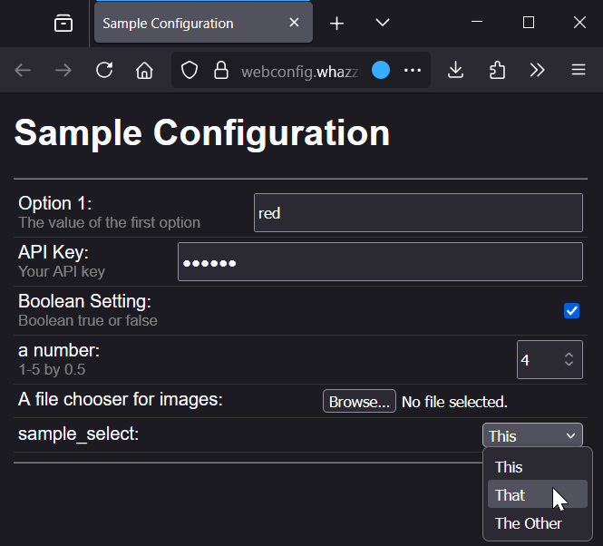

# Web Configurator for Streamer.bot Extensions

This Streamer.bot utility lets extension authors add a browser-based UI to their extension, giving their users an easier way to set up and configure their extension. It is an alternative to telling them to add or edit `Set Argument` subactions, or to code a custom Windows UI with WinForms or WPF, and uses only a simple JSON document to describe the configurable elements.



### Why Use It?

* You want a nice UI for configuration, but you don't know how or want to create a DLL for a Windows UI.
* Your don't want your users' Set Argument options overwritten when they import new versions.
* You want the UI to work on Linux and Mac platforms too.
* You want the UI to work with both Streamer.bot 0.2.8 and 1.0.0.

### Why Not Use It?

* Adds a dependency on the WebSocket server, which not all users may have set up. The configurator will try to guide them to get it turned on and set up correctly, but nothing is foolproof.
* You don't want your configuration kept in Streamer.bot global variables.
* Your configuration data is too complex to represent as a set of individual values.

## Usage for Users

When a user installs your extension, they will:
* Run a particular action in a way that you specified in your instructions. OR, you can use the autorun feature of export/import to automatically run the configuration action. This action will...
* ... bring up your extension's configuration page in their default browser.
    * The user's websocket server will need to be running
    * If they aren't, or aren't using the default websocket server settings, then they will be greeted with a page to enter the correct settings, with help to guide them..
* They will edit the configuration options, which take effect immediately.

(image here)

## Developer Usage

To include the Web Configurator UI in your extension:

1. Import the [WebConfigurator.sb](https://raw.githubusercontent.com/WhazzItToYa/Streamerbot-WebConfigurator/refs/heads/main/WebConfig.sb) into your Streamer.bot
2. Design your extension so that user-configurable data is kept in persistent global variables
    * When your extension needs the user's configuration values, use the [Get Global](https://docs.streamer.bot/api/sub-actions/core/globals/global-get) subaction or the C# `CPH.GetGlobalVar` function to fetch its value.
    * Keep in mind that your variables have to co-exist with all other extensions' global variables, so choose names that are likely to be unique to your extension.
3. As a part of your extension, create an action which the user can invoke to bring up the config editor, say, via a Test trigger, or automatically on import with the Auto Execute feature. In that action, add the subactions:
    * Set Argument "configSpec" to "{your json config descriptor}". See [the section below](#the-configuration-descriptor) for a description of what this is.
    * Run Action "WC - Open Configuration"

When your user runs this action, it will open their browser to a page that allows them to edit all of the configuration options you specified. There is an example configuration action in the WebConfigurator import.

### Configuration Editor

You can run the configurator page in editor mode, which allows you to edit the json, and live-updates the corresponding config UI. To activate, add the following query argument to the URL:

  `&edit=true`

A good place to start creating a brand new configuration for your extension is to [edit the Sample Configuration Page](https://webconfig.whazzittoya.com/?connect=false&edit=true&configUrl=sample.json), copying and modifying the various options.

Once you have the configuration the way you like it, press the "Copy to clipboard" button and you'll get a compact version of the JSON that you can paste into your configuration action.

### Offline Mode

If for some reason, you cannot or do not want to connect the Web UI page to Streamer.bot, you can run it in offline mode by adding the query argument:

  `&connect=false`

## The Configuration Descriptor

You specify the editable options of your extension in a JSON document. This document defines each configuration option that the user may edit.  Each object in the "options" array corresponds to one Streamer.bot global variable containing some piece of configuration data of your extension.

```javascript
{
    "title" : "Title of your Extension"
    "options" : [
        {
            "name" : "welcomeMessage", // S.bot variable name
            "type" : "text" | "password" | "number" | "bool" | "select" | "file",
            
            "label" : "Welcome message",           // Label to display (optional, defaults to "name")
            "description" : "New viewer greeting", // small help text (optional)
            "default" : "Welcome to the stream!",  // Initial value (optional)

            // Other options depending on "type":
            
            // For "number" or "slider" type:
            
            "min" : 5,  // (required for slider) smallest number you can configure
            "max" : 10, // (required for slider) largest number you can configure
            "inc" : 0.5, // (optional) Allowed increments of the number

            // For "select" (i.e., dropdown list)
            
            "values" : [
                        "value1",     // First dropdown
                        "value2",     // Second dropdown
                        ["value314159", "pi"] // Third dropdown, Displays "pi" to user, but the stored value is "value314159"
                       ],

            // For "file" (a file picker)

            "accept" : "image/*,video/*,.webp", // The extensions or mime types to filter by
                       
        },
        ... more options ...
    ]
}

```

Example JSON: 

```json
{
    "title" : "Sample Configuration Title",
    "options" : [
        {
            "name" : "sampleString",
            "type" : "string",
            "label" : "Sample String",
            "description" : "A text value",
            "default" : "default text"
        },
        {
            "name" : "sampleNumber",
            "type" : "number",
            "label" : "Sample Number",
            "description" : "A number with optional min, max, and increments",
            "min" : "1",
            "max" : "10",
            "inc" : "0.5",
            "default" : 4
        },
        {
            "name" : "sampleSlider",
            "type" : "slider",
            "label" : "Sample Slider",
            "description" : "A number slider with required min, max, and increments",
            "min" : "0",
            "max" : "100",
            "inc" : "1",
            "default" : 4
        },
        {
            "name" : "sampleBoolean",
            "type" : "bool",
            "label" : "Sample Boolean",
            "description" : "a true or false value",
            "default" : true
        },
        {
            "name" : "sampleSelect",
            "type" : "select",
            "label" : "Sample Selection",
            "description" : "A list of simple values, or values and their labels",
            "values" : [
                "Value1", "Value2", ["Value3", "Value3's Label"]
            ],
            "default" : "Value2"
        },
        {
            "name" : "samplePassword",
            "type" : "password",
            "label" : "Sample Password",
            "description" : "Keep it secret, keep it safe.",
            "default" : "hunter2"
        },
        {
            "name" : "sampleFile",
            "type" : "file",
            "label" : "Sample File",
            "description" : "A chooser for file paths, with optional type filter",
            "accept" : "image/*"
        }

    ]
}
```

To see what this looks like in action and to edit your own configuration, visit [Sample Configuration Page](https://webconfig.whazzittoya.com/?connect=false&configUrl=sample.json)

## Contact Info

For bug reports, or feature requests, [open an issue](https://github.com/WhazzItToYa/Streamerbot-WebConfigurator/issues).

For questions or help, drop a message into the [Discord post](https://discord.com/channels/834650675224248362/1390507952833822781).
